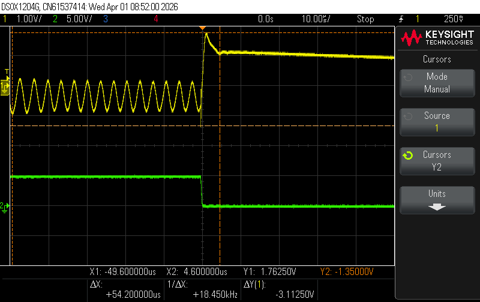
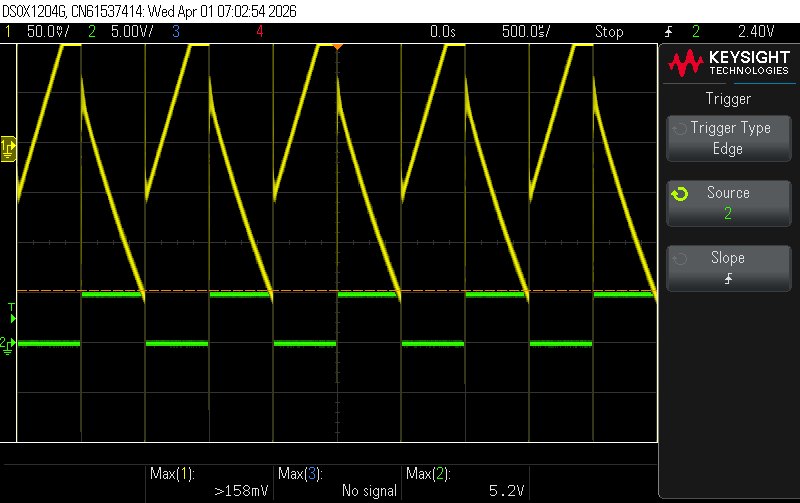
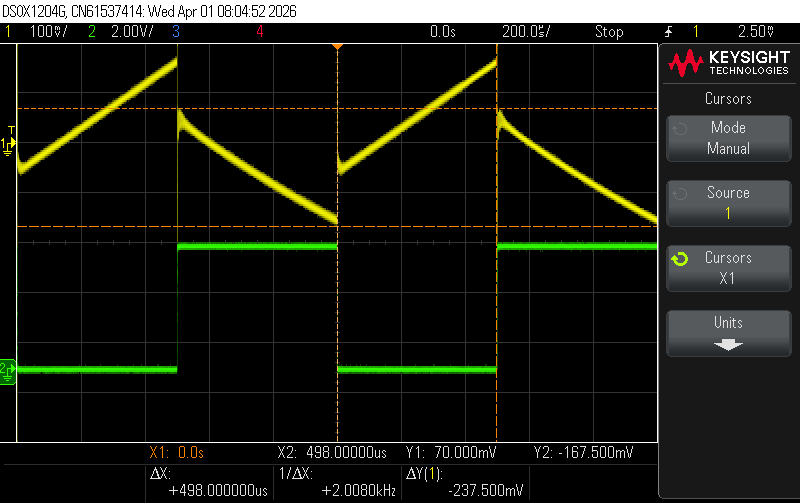

# LDO Transient Response & Stability Analysis

## Project Overview
This project focuses on the characterization and optimization of a **3.3V Low-Dropout (LDO) Regulator** power rail. By evaluating the system across three distinct capacitance profiles, I diagnosed root causes of control loop instability and iteratively tuned the hardware to achieve a critically damped transient recovery. 

This analysis demonstrates the critical relationship between output capacitor selection (value and ESR) and the phase margin of analog feedback loops.

## Technical Specifications & Tools
* **Target Rail:** 3.3V DC
* **Equipment:** * **Oscilloscope:** Keysight DSOX1204G (used for $\Delta V$, $\Delta t$, and frequency analysis)
    * **Signal Generation:** Rigol Function Generator (simulating step-load transients)
    * **Power:** Variable DC Bench Power Supply
* **Key Metrics:** Settling Time ($t_s$), Voltage Undershoot ($V_{droop}$), and Oscillation Frequency ($f_{osc}$).

---

## Stability Characterization: Three Case Studies

I tested the LDO with three different capacitor configurations to map the "stability tunnel" of the regulator and observe the transition from instability to critical damping.

### Case 1: Loop Instability (Non-Ideal ESR/Capacitance)
In the first configuration, the control loop reached an unstable state due to insufficient phase margin. 
* **Observation:** Significant periodic ringing and rail collapse during load steps.
* **Result:** Identified a sustained **18.45 kHz oscillation** and a massive **3.11V droop**. 
* **Diagnosis:** The high ESR/low capacitance combination introduced a pole-zero mismatch, pushing the loop into an underdamped, oscillatory state.

*Figure 1: Loop instability exhibiting 18.45kHz oscillation and 3.11V droop.*

### Case 2: Marginal Stability
The second configuration improved the DC level but exhibited poor transient recovery.
* **Observation:** Large sawtooth discharge patterns and high-frequency switching noise.
* **Result:** Slow recovery times exceeding 1.5ms with significant noise injection onto the rail.
* **Diagnosis:** While not oscillating indefinitely, the system was critically underdamped, leading to "ringing" that would likely cause logic resets in sensitive downstream digital ICs.

*Figure 2: Marginal stability with sawtooth discharge and poor load regulation.*

### Case 3: Optimized & Critically Damped (Final Solution)
The final iteration utilized an optimized capacitance profile to achieve the ideal response for power integrity.
* **Observation:** Rapid, smooth return to steady-state 3.3V with zero secondary oscillations.
* **Settling Time ($t_s$):** **498.0 $\mu$s**
* **Voltage Undershoot:** **237.5 mV**
* **Diagnosis:** Successfully achieved a **critically damped** state by balancing bulk capacitance with optimal ESR to provide the necessary zero for loop stability.

*Figure 3: Optimized critically damped response (498µs settling time).*

---

## Performance Summary Table

| Metric | Case 1: Unstable | Case 2: Marginal | Case 3: Optimized |
| :--- | :--- | :--- | :--- |
| **Stability State** | Oscillatory | Underdamped | **Critically Damped** |
| **Oscillation Freq.** | 18.45 kHz | N/A (Noise) | **None** |
| **Peak Undershoot** | 3.11 V | ~1.16 V | **237.5 mV** |
| **Settling Time ($t_s$)** | N/A | >1.5 ms | **498.0 $\mu$s** |

---

## Engineering Takeaways

1.  **ESR Sensitivity:** Confirmed that LDO stability is not just about the *amount* of capacitance, but the **Equivalent Series Resistance (ESR)** which acts as a critical zero in the control loop.
2.  **Validation Methodology:** Developed a repeatable test bench using a function generator to pulse the load, allowing for real-time visualization of the transient response on the DSO.
3.  **Power Integrity (PI):** Successfully mitigated power rail fluctuations that could lead to signal integrity issues or bit errors in embedded systems.
